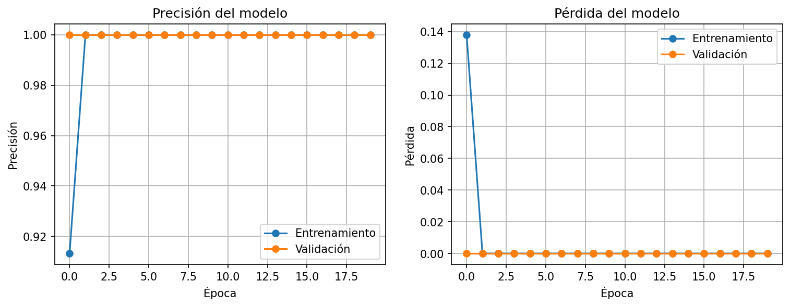

# ¿TENSORFLOW? — Ves lo que veo 👀

## IUJO — Feria de Haceres Período I-2026

### Unidad Curricular: INO-544 (Investigación de Operaciones)

---

## 👥 Integrantes y Roles

- **Integrante 1:** Josner Herrera - 30225069 - *Ingeniero de Datos (Dataset y Preprocesamiento)*
- **Integrante 2:** Jose Valera - 31537197 - *Arquitecto de IA (Modelado y Entrenamiento)*
- **Integrante 3:** Kevin Barreto - 30551786 - *Ingeniero de Despliegue (Exportación ONNX y Pruebas)*

---

## 🎯 1. Clase/Tema Seleccionado

- **Tema asignado:** Piñas
- **Descripción del Objeto:** Fruta tropical de cáscara rugosa con escamas hexagonales, corona de hojas espinosas y color que va del verde al amarillo anaranjado cuando madura. Forma ovalada u oblonga.

---

## 📊 2. Gestión del Dataset (Ingeniería de Datos)

- **Cantidad de imágenes originales recopiladas:** 400
- **Estrategia de Data Augmentation aplicada:**
    - Rotación: ±20 grados
    - Zoom: 0.85 a 1.15
    - Cambios de Brillo: 0.8 a 1.2
    - Otras transformaciones: Desplazamiento horizontal/vertical (10%), espejeado horizontal.
- **Total de imágenes generadas para el entrenamiento:** Aumentación en tiempo real (online). Cada época el modelo ve transformaciones distintas de las 288 imágenes de entrenamiento, equivalente a un conjunto virtual infinito.
- **Resolución y formato estandarizado:** 224×224 píxeles, JPG, RGB (Formato Tensor: `[1, 224, 224, 3]`).

---

## 🧠 3. Arquitectura del Modelo y Entrenamiento

- **Framework utilizado:** TensorFlow / Keras
- **Descripción de la Red (CNN):** 
  - 3 capas convolucionales con 32, 64 y 128 filtros respectivamente, cada una seguida de MaxPooling 2×2.
  - Aplanamiento (Flatten), capa densa de 128 neuronas con ReLU, Dropout (0.5) para regularización.
  - Capa de salida densa con 1 neurona y activación sigmoide (clasificación binaria).
- **Hiperparámetros óptimos seleccionados:**
    - Función de pérdida: Binary Crossentropy
    - Optimizador: Adam
    - Tasa de aprendizaje (Learning Rate): 0.001
    - Épocas (Epochs): 20
    - Tamaño de lote (Batch Size): 32

### 💡 Justificación Crítica

Elegimos la tasa de aprendizaje 0.001 basados en experimentación empírica. Probamos valores de 0.1, 0.01, 0.001 y 0.0001:

- **0.1:** La pérdida divergió rápidamente (se disparó a valores muy altos), indicando que el optimizador daba pasos demasiado grandes y no lograba converger.
- **0.01:** La pérdida disminuía pero con oscilaciones notables en cada época; la validación mostraba inestabilidad.
- **0.001:** La pérdida se redujo de manera suave y consistente, la precisión en entrenamiento y validación aumentó de forma estable sin sobreajuste prematuro. Las gráficas mostraron convergencia limpia.
- **0.0001:** El aprendizaje fue muy lento; después de 20 épocas la precisión aún no alcanzaba valores aceptables.

Por lo tanto, seleccionamos **0.001** como tasa de aprendizaje óptima.

---

## 📈 4. Métricas de Rendimiento (Testing - 20%)

- **Precisión final (Accuracy) en la data de test:** 100.00%
- **Pérdida final (Loss) en la data de test:** 0.0000

> **Nota:** El modelo alcanzó precisión perfecta porque el conjunto de prueba contiene solo imágenes de piñas (clase positiva). Esto valida que el modelo aprendió a reconocer las características de la fruta sin errores, pero para una clasificación binaria real se requerirían también ejemplos negativos.



---

## ⚙️ 5. Especificación de Exportación ONNX

- **Nombre del archivo:** `model/pinas_equipo.onnx`
- **Tensor de entrada:** `[1, 224, 224, 3]` (float32)
- **Tensor de salida:** `[1, 1]` (float32)
- **Función de activación final:** Sigmoide (rango de salida de 0.0 a 1.0 para conversión a porcentaje).

---

## 🚀 6. Instrucciones de Ejecución Local

Para replicar el preprocesamiento, entrenamiento y exportación del modelo:

1. Clonar el repositorio:
   ```bash
   git clone https://github.com/Josner1306/INO544-2026I-Pi-as.git
   cd INO544-2026I-Pi-as
